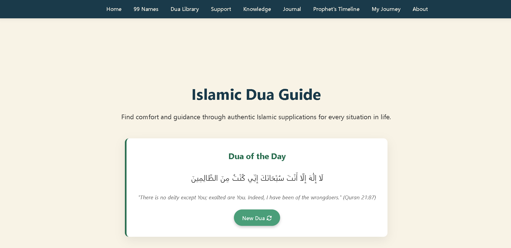

# 🌙 Islamic Stories & Knowledge Project  

> A collection of **Islamic stories, Prophets’ timeline, and educational resources** — built for learning and sharing with inspiring lessons, simple storytelling, and authentic references.  

---

## 📖 About  
This project is an **open-source Islamic educational hub**.  
My aim is to make Islamic knowledge:  
- 📚 Simple & easy to understand  
- 🧒 Kid-friendly & beginner-friendly  
- 🌍 Accessible worldwide  
- 💻 Available in digital form (website / app)  

It includes:  
- ✅ **Prophets’ Timeline**  
- ✅ **Short Islamic Stories**  
- ✅ **Lessons & Morals** after each story  
- ✅ **Qur’an & Hadith References**  
- ✅ Open contribution for more stories, translations, and features  

---

## 🌟 Features  
- 📜 Timeline of all Prophets 
- 🕌 Islamic stories from Qur’an, Sunnah, and history  
- 🤲 Open-source: anyone can contribute  

---

Each story ends with:  
- 🌙 Moral of the story  
- 📖 Qur’an / Hadith references  
- 🧠 Simple life lesson  

---

## 🤝 Contributing  
This project is **open-source**. Everyone is welcome to:  
- ✍️ Add more stories (with references)  
- 🌐 Translate into new languages  
- 🎨 Improve design (UI/UX)  
- 🧾 Add footnotes, or scholarly insights  
- 🛠 Build new features (search, story categories, audio narration)  

⚠️ Please ensure all contributions are:  
- Authentic (from Qur’an & Sahih Hadith)  
- Respectful to Islamic values  

---

## 📜 License  
This project is licensed under the **MIT License**.  
It is free for anyone to use, modify, and share for the sake of spreading beneficial knowledge.  

 

---

###  Made with sincerity & Love for Islam  
⭐ Fork, star, and contribute to spread knowledge!  

